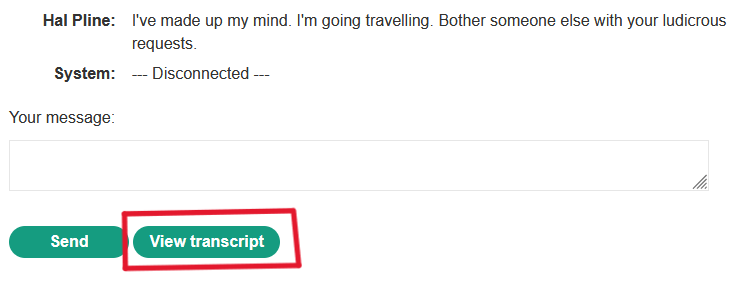

# Write-up: Insecure direct object references

Lab-Link: **[Insecure direct object references](https://portswigger.net/web-security/access-control/lab-insecure-direct-object-references)**

Difficulty: APPRENTICE

This write-up for the lab *Unprotected admin functionality* is part of my walkthrough series for [PortSwigger's Web Security Academy](https://portswigger.net/web-security).

## Summary

An **Access Control vulnerability** allows me to access the private chats of other users.

## Description

This lab stores user **chat logs** directly on the server's file system, and retrieves them using static URLs.

Solve the lab by finding the `password` for the user `carlos`, and logging into their account.

## what I do

1. From the description, I deduced that there is a chat related to the user `carlos`. I need to access it in order to know `carlos`'s `password`.

2. In the Home page, I found that there is a page dedicated to __live chat__.

3. When I entered the live chat page, I found that I could get the chat as a __txt file__ on my PC by clicking on __View transcript__.

4. Therefore, I used the [Burp Suite](https://portswigger.net/burp/communitydownload) tool to intercept the request and see what was inside it, as well as to see how the response content.

5. In the request, I found that my chat was saved in a file named `3.txt`, so I thought of changing the name to `1.txt` to access the other files stored on the server.

6. Indeed, I accessed `carlos`'s chat and through it, I managed to find out his `password`.

7. I used `carlos`'s `password` to access his account,indeed, I accessed `carlos`'s account.

## Short steps

1. Select the __Live chat__ tab.

2. Send a message and then select __View transcript__.

3. Review the URL and observe that the transcripts are text files assigned a filename containing an incrementing number.

4. Change the filename to `1.txt` and review the text. Notice a `password` within the chat transcript.

5. Return to the main lab page and log in using the stolen credentials.

__congratulations!__

## References

*OWASP*: https://owasp.org/Top10/A01_2021-Broken_Access_Control/

*PortSwigger reference & labs*: https://portswigger.net/web-security/access-control

*Medium*: https://cyberw1ng.medium.com/understanding-access-control-vulnerability-in-web-app-penetration-testing-2023-1d29eadd86b7

*Youtube*: [Rana Khalil](https://youtu.be/EaMWR5Cmjkg?si=WFQvM75-rqfUOar9) - [Michael Sommer](https://youtu.be/Sd8jL96H0hc?si=Rr_ZsEgm74OuGDsi) - [Intigriti](https://youtu.be/jgbHaALms_Q?si=wtWNLp37Im9WEVyE)