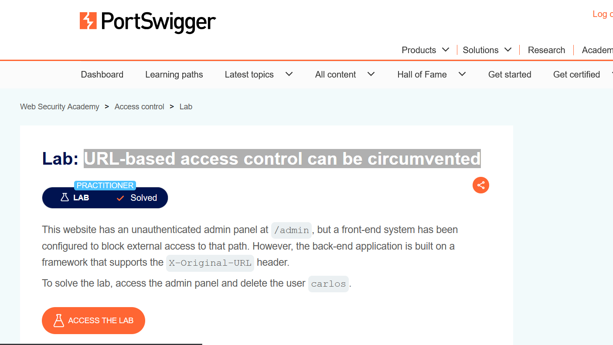
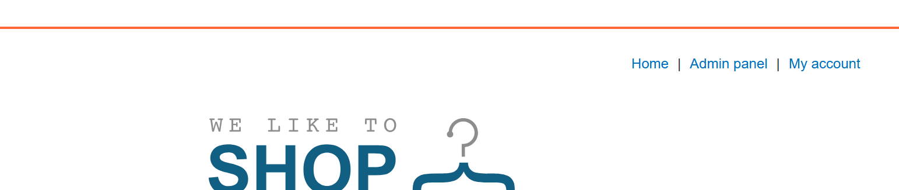
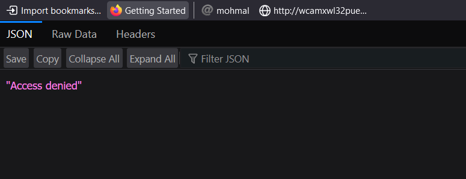
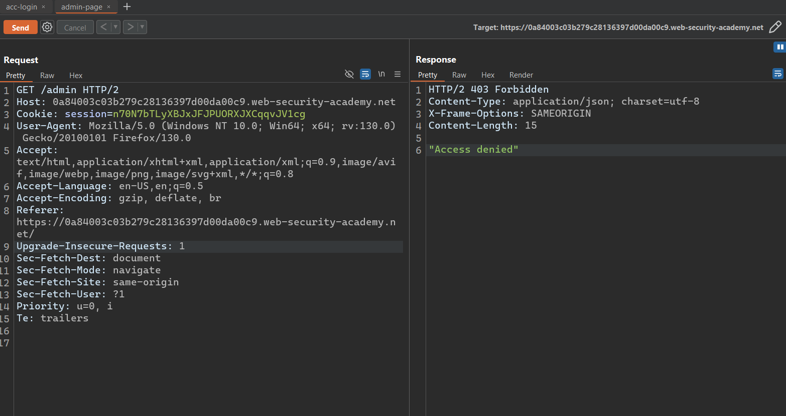
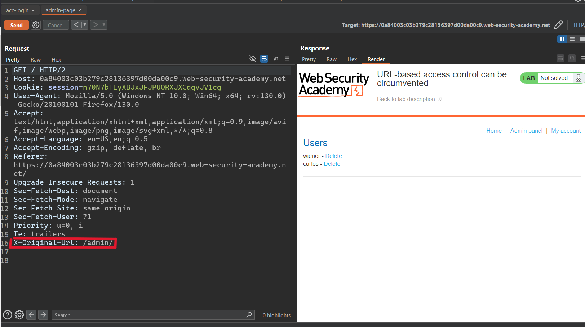
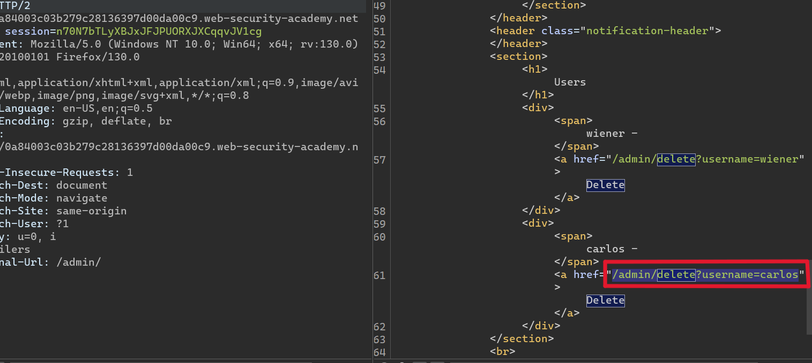
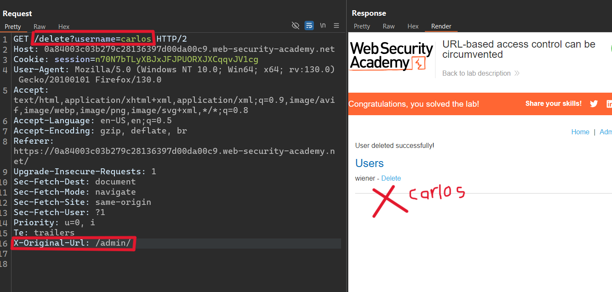

# Writ-up: URL-based access control can be circumvented

Lab-Link: **[URL-based access control can be circumvented](https://portswigger.net/web-security/access-control/lab-url-based-access-control-can-be-circumvented)**

Difficulty: PRACTITIONER

This write-up for the lab *Unprotected admin functionality* is part of my walkthrough series for [PortSwigger's Web Security Academy](https://portswigger.net/web-security).

## Summary

Access control is the application of constraints on who or what is authorized to perform actions or access resources. In the context of web applications, access control is dependent on authentication and session management:

## Description

This website has an unauthenticated admin panel at `/admin`, but a front-end system has been configured to block external access to that path. However, the back-end application is built on a framework that supports the `X-Original-URL` header.

To solve the lab, access the admin panel and delete the user `carlos`.

## Impact

* mAuthentication confirms that the user is who they say they are.

* Session management identifies which subsequent HTTP requests are being made by that same user.

* Access control determines whether the user is allowed to carry out the action that they are attempting to perform.

## what I do

1. Through the description, I learned that there is an admin page where `Carlos` must be deleted.

2. But it is not allowed to access the **admin** page through the link, only through the `X-Original-URL` header.

3. Therefore, I thought of intercepting the **request** to modify it and ensure that the `X-Original-URL` header is added along with the **admin** page path.

4. Adding the `X-Original-URL` header and the **admin** path.

5. Indeed, I was able to access the **admin** page and started searching for the delete function to delete `Carlos`.

6. I deleted `Carlos`.

__congratulations!__

## Short steps

1. Try to load `/admin` and observe that you get blocked. Notice that the response is very plain, suggesting it may originate from a front-end system.

2. Send the request to Burp Repeater. Change the URL in the request line to `/` and add the HTTP header `X-Original-URL: /invalid`. Observe that the application returns a "not found" response. This indicates that the back-end system is processing the URL from the `X-Original-URL` header.

3. Change the value of the `X-Original-URL` header to `/admin`. Observe that you can now access the admin page.

4. To delete `carlos`, add `?username=carlos` to the real query string, and change the `X-Original-URL` path to `/admin/delete`.

## References

*OWASP*: https://owasp.org/Top10/A01_2021-Broken_Access_Control/

*PortSwigger reference & labs*: https://portswigger.net/web-security/access-control

*Medium*: https://cyberw1ng.medium.com/understanding-access-control-vulnerability-in-web-app-penetration-testing-2023-1d29eadd86b7

*Youtube*: [Rana Khalil](https://youtu.be/AwvQrdE1Wtc) or [Michael Sommer](https://youtu.be/Rj0B12Vsh_E)

## Used tools

_Burp Suite_: https://portswigger.net/burp/communitydownload