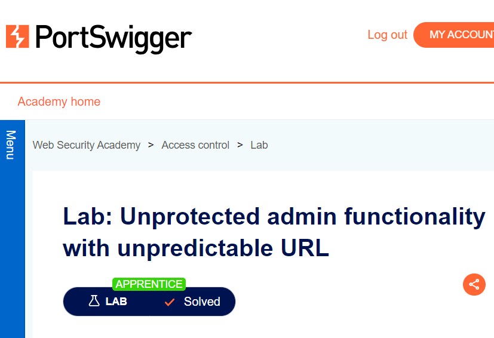
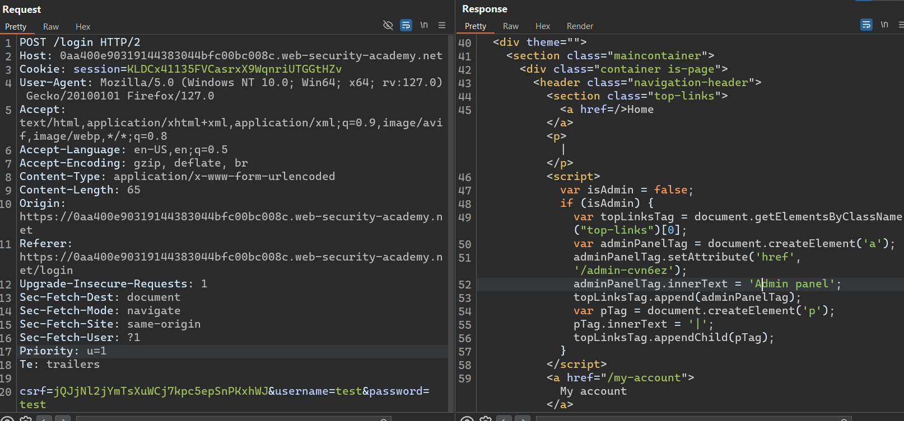
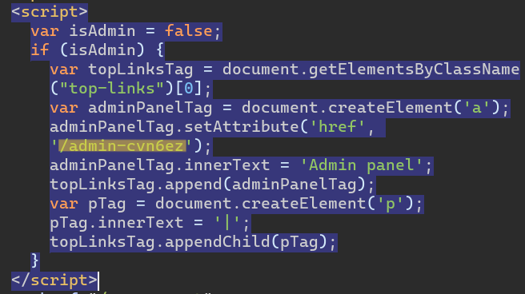
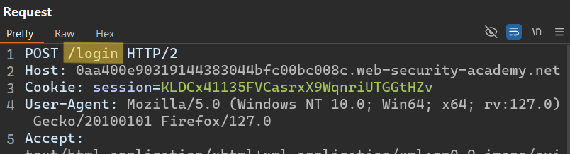
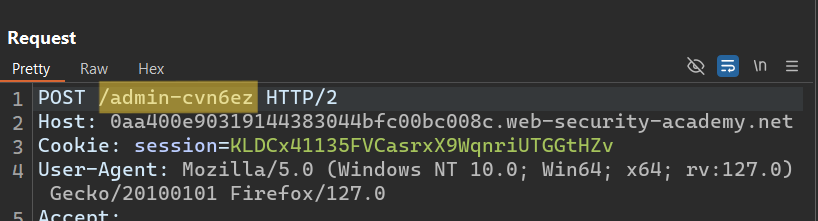
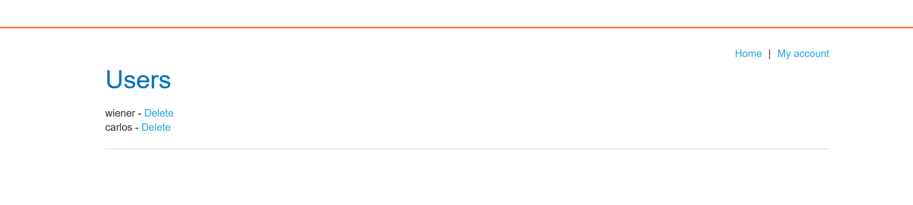

# Write-up: Unprotected admin functionality with unpredictable URL

Lab-Link: **[Unprotected admin functionality with unpredictable URL](https://portswigger.net/web-security/access-control/lab-unprotected-admin-functionality-with-unpredictable-url)**

Difficulty: APPRENTICE

This write-up for the lab *Unprotected admin functionality* is part of my walkthrough series for [PortSwigger's Web Security Academy](https://portswigger.net/web-security).

## Summary

An __Access Control vulnerability__ was discovered in the __Admin Panel__ module of the web application, allowing attackers to bypass authentication have admin privileges.

## Description

-This lab has an unprotected __admin panel__. It's located at an unpredictable location, but the location is disclosed somewhere in the application. 

-Solve the lab by accessing the __admin panel__, and using it to delete the user `carlos`.

## Impact

the __admin panel__ unprotected, by accessing the __admin panel__, directly the attacker can deleting users accounts from the site.

## what I do

1. From the description of the lab, I concluded that this was an **admin page**, so I had to access it.

2. I started doing a quick testing for the site and reading the source code quickly to get any information on it or to knowing whether there are important files or not.

3. I found a **login page** that I tried to do a quick test on.

4. Using [Burp Suite](https://portswigger.net/burp/communitydownload) I intercepted the `request` to see the `response`.

5. By reviewing the `response` I found the **JavaScript** code, by reviewing the code I found the path to the **admin panel**.

6. In the URL, I replaced the **login** path with the **admin panel** path `/admin-cvn6ez`.

7. Immediately found that I have **admin privileges** and can delete user accounts.

8. delete `Carlos` to solve the lab.

## Short steps

1.	Review the lab home page's source using [Burp Suite](https://portswigger.net/burp/communitydownload) or your web browser's developer tools. 

2.	Observe that it contains some **JavaScript** that discloses the URL of the **admin panel**. 

3.	Load the **admin panel and delete** `carlos`. 

__congratulations!__

## References

*OWASP*: https://owasp.org/Top10/A01_2021-Broken_Access_Control/

*PortSwigger reference & labs*: https://portswigger.net/web-security/access-control

*Medium*: https://cyberw1ng.medium.com/understanding-access-control-vulnerability-in-web-app-penetration-testing-2023-1d29eadd86b7

*Youtube*: [Rana Khalil](https://youtu.be/7Jve11VySNU?si=rQlKamqNGbBRHG27) or [Michael Sommer](https://youtu.be/mml8SlN2Or4?si=V4g8TXxld7AoNLh1)
