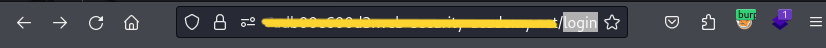

# Write-up: Unprotected admin functionality

Lab-Link: __[Unprotected admin functionality Lab](https://portswigger.net/web-security/access-control/lab-unprotected-admin-functionality)__

This write-up for the lab *Unprotected admin functionality* is part of my walkthrough series for [PortSwigger's Web Security Academy](https://portswigger.net/web-security).

## Summary

An __Access Control vulnerability__ was discovered in the __Admin Panel__ module of the web application, allowing attackers to bypass authentication have admin privileges.

## Description

-This lab has an unprotected **admin panel**.

-Solve the lab by deleting the user `carlos`.

## Lab idea

By testing the site, the hacker can access files containing information that should not be accessible to a normal user. This information enabled the hacker to reach the **Admin Panel** and obtain admin privileges.

## Impact

the __Admin Panel__ unprotected, by accessing the admin panel, directly the attacker can deleting users accounts from the site.

## what I do

1-From the description of the lab, I concluded that this was an **admin** page, so I had to access it.

2-I started doing a quick testing for the site and reading the source code quickly to get any information on it or to knowing whether there are important files or not.

3-I found a `login` page that I tried to do a quick test on, but that was not my primary goal.

4-Here I started searching for other files instead of the login page, so I used the [dirsearch](https://github.com/maurosoria/dirsearch) tool to access any important files.

5-A few files appeared but what caught my attention was the `robots.txt` file so I opened this file. 

6-In the `robots.txt` file, the path to the `admin` page was found.

7-I went to that path and immediately found that I have **admin privileges** and can delete user accounts.

8-and delete `Carlos` to solve the lab.

-or us the delete function to `carlos`.

## Short steps

1-Go to the lab and view `robots.txt` by appending `/robots.txt` to the lab URL.
	
2- In the URL bar, replace `/robots.txt` with `/administrator-panel` to load the **admin panel**. 
	
3-Delete `Carlos`.
	
__congratulations!__

## References

*OWASP*: https://owasp.org/www-community/Access_Contro

*PortSwigger reference & labs*: https://portswigger.net/web-security/access-control

*Medium*: https://medium.com/@insightfulrohit/all-about-broken-access-control-cf6ec98a990b