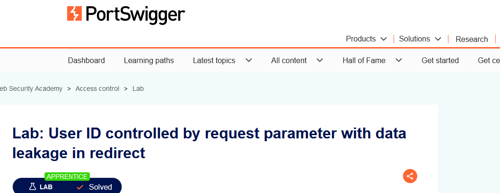
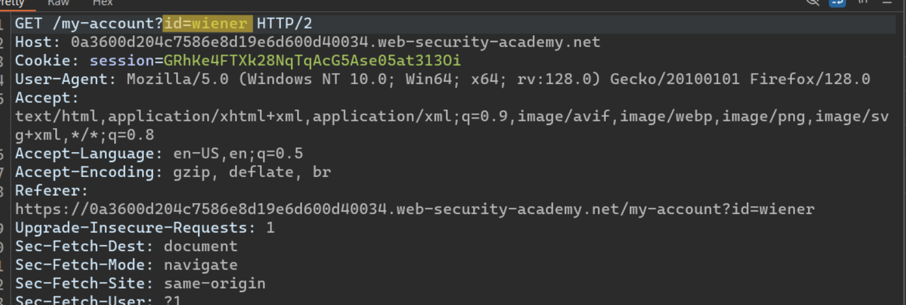
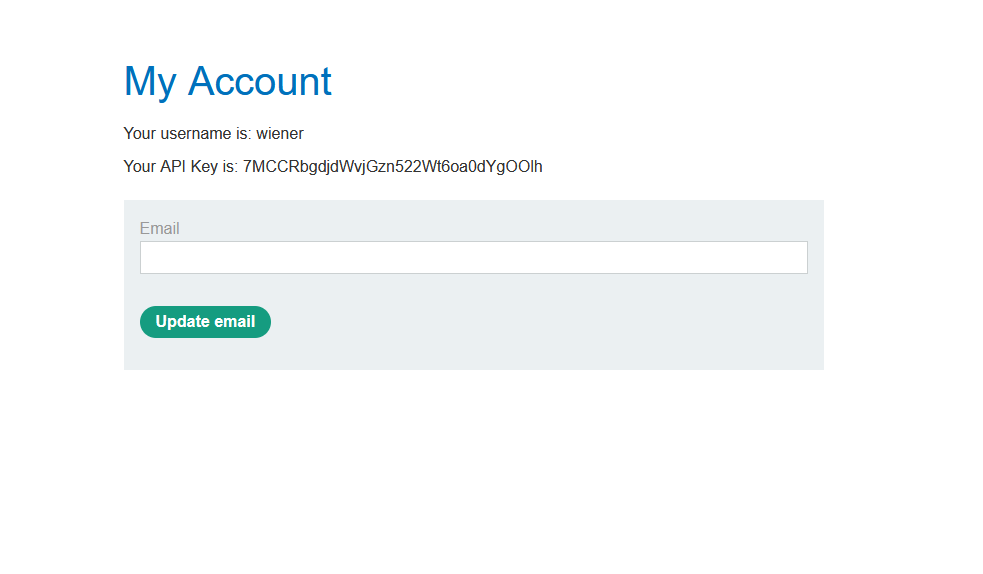
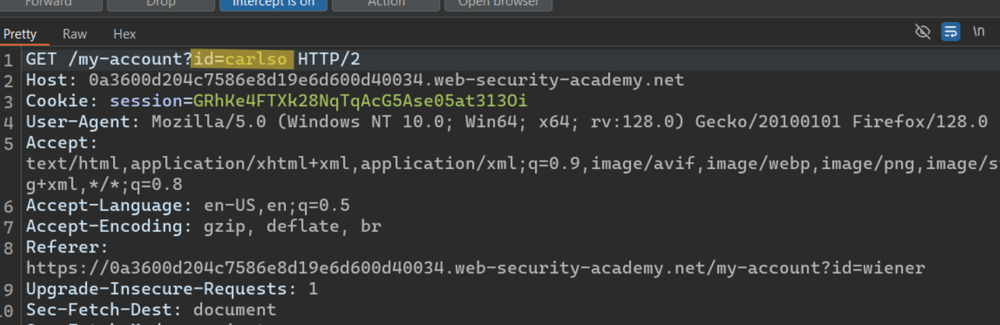
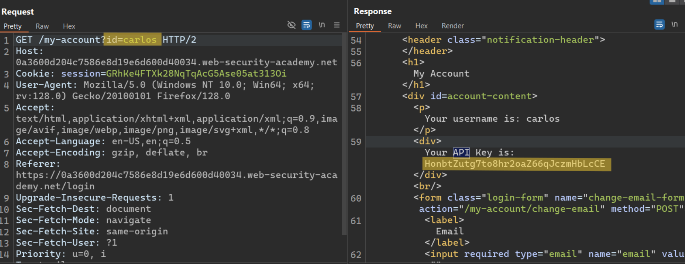
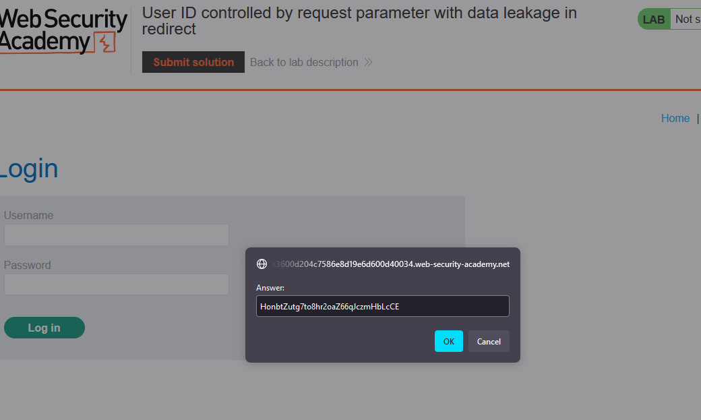

# Writ-up: ID controlled by request parameter with data leakage in redirect

Lab-Link: **[ID controlled by request parameter with data leakage in redirect](https://portswigger.net/web-security/access-control/lab-user-id-controlled-by-request-parameter-with-data-leakage-in-redirect)**

Difficulty: APPRENTICE

This write-up for the lab *Unprotected admin functionality* is part of my walkthrough series for [PortSwigger's Web Security Academy](https://portswigger.net/web-security).

## Summary

An __Access Control vulnerability__ in the __request parameter__ makes it easy to access other users' accounts.

## Description

This lab contains an [access control](https://portswigger.net/web-security/access-control) vulnerability where sensitive information is leaked in the body of a redirect response.

To solve the lab, obtain the [API](https://www.ibm.com/topics/api) key for the user `carlos` and submit it as the solution.

You can log in to your own account using the following credentials: `wiener:peter`

## Impact

By testing the site, the hacker can modify the request he sends in order to access other users' accounts.

## what I do

1. From the description of the lab, I inferred that I need to get a user account named `Carlos` to access his [API](https://www.ibm.com/topics/api).

2. I started doing a quick testing for the site and reading the source code quickly to get any information on it or to knowing whether there are important files or not.

3. I found a **login page** that I tried to do a quick test on.

4. Using [Burp Suite](https://portswigger.net/burp/communitydownload) I intercepted the `request` to see the `response`.

5. It also got `wiener`'s [API](https://www.ibm.com/topics/api).

6. I replaced `wiener` with `carlos` in the `id` parameter.

7. When I submitted the request, I was redirected to the home page. However, upon reviewing the `response`, I found that I had indeed received `carlos`'s [API](https://www.ibm.com/topics/api).

8. I submitted a solution to solve the lab.

## Short steps

1. Log in using the supplied credentials and access your account page.

2. Send the request to [Burp Repeater](https://portswigger.net/burp/documentation/desktop/tools/repeater).

3. Change the __id__ parameter to `carlos`.

4. Observe that although the __response__ is now redirecting you to the home page, it has a body containing the [API](https://www.ibm.com/topics/api) key belonging to `carlos`.

5. Submit the [API](https://www.ibm.com/topics/api) key.

__congratulations!__

## References

*OWASP*: https://owasp.org/Top10/A01_2021-Broken_Access_Control/

*PortSwigger reference & labs*: https://portswigger.net/web-security/access-control

*Medium*: https://cyberw1ng.medium.com/understanding-access-control-vulnerability-in-web-app-penetration-testing-2023-1d29eadd86b7

*Youtube*: [Rana Khalil](https://youtu.be/aafn8BmHcIE?si=ZNmf2KpEZgT8ZgnN) or [Michael Sommer](https://youtu.be/nrly0jHYFqM?si=hTLcolPOhU0nDREc)