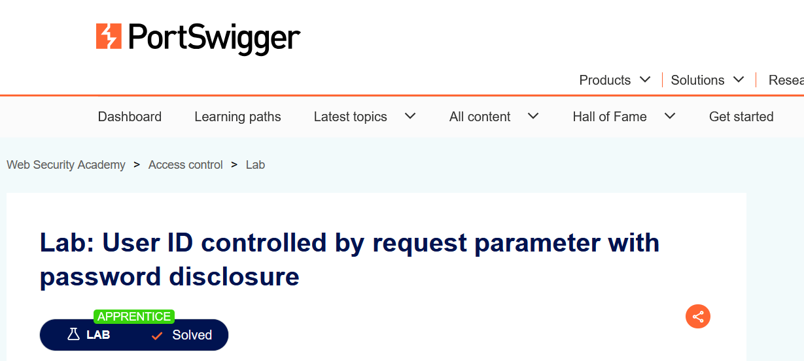
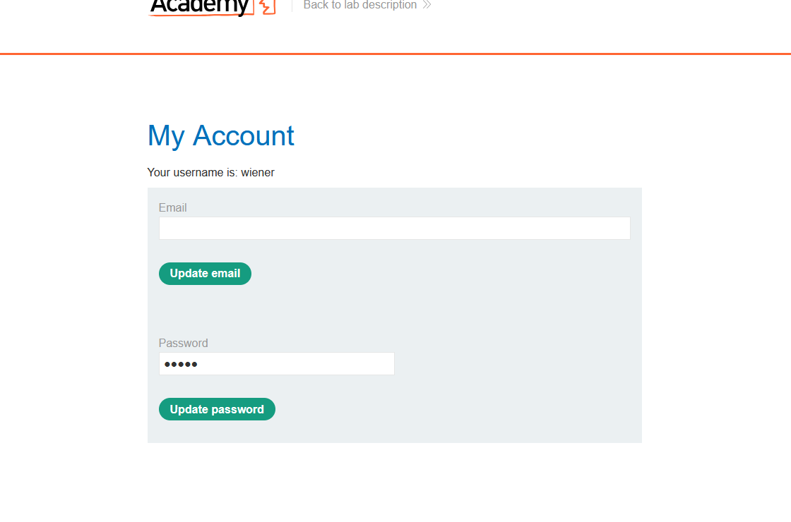
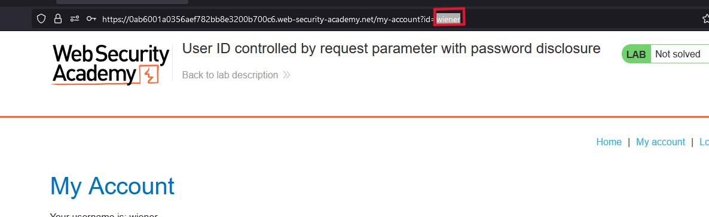
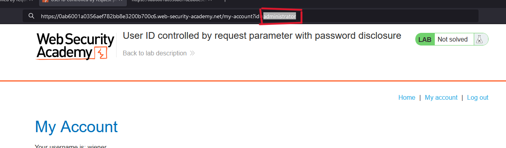
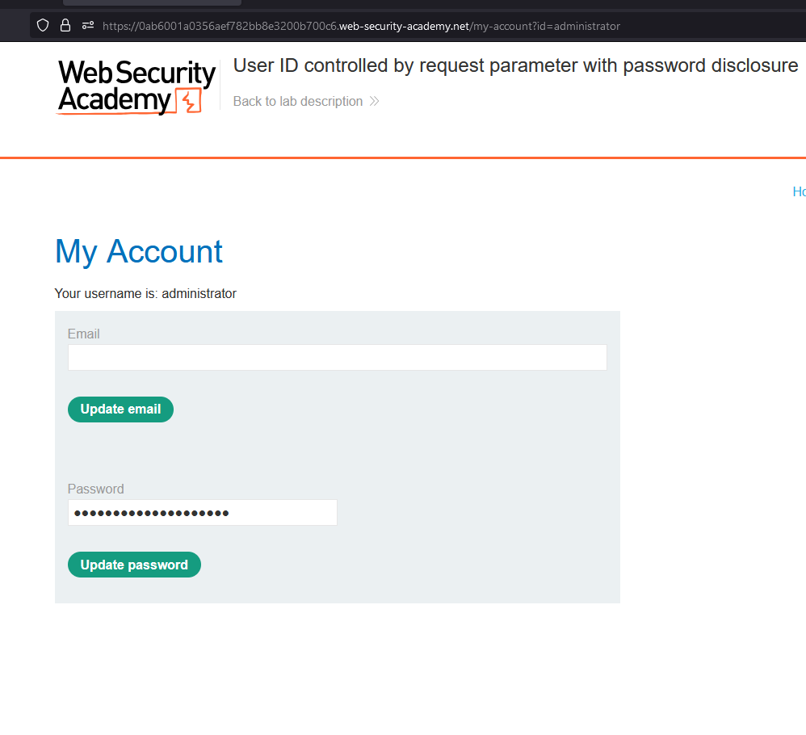
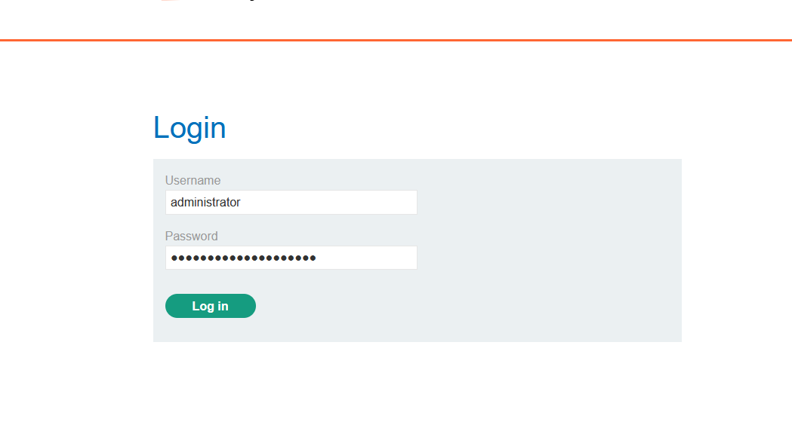
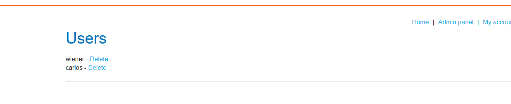

# Writ-up: User ID controlled by request parameter with password disclosure

Lab-Link: **[User ID controlled by request parameter with password disclosure](https://portswigger.net/web-security/access-control/lab-user-id-controlled-by-request-parameter-with-password-disclosure)**

Difficulty: APPRENTICE

This write-up for the lab *Unprotected admin functionality* is part of my walkthrough series for [PortSwigger's Web Security Academy](https://portswigger.net/web-security).

## Summary

There is very important information that the user can access, and by exploiting it, they can gain __admin privileges__.

## Description

This lab has user account page that contains the current user's existing password, prefilled in a masked input.

To solve the lab, retrieve the administrator's password, then use it to delete the user `carlos`.

You can log in to your own account using the following credentials: `wiener:peter`. 

## Impact

There is very important information that the user can access, and by exploiting it, they can gain __admin privileges__, gaining access to the __Admin panel__ and deleting users.

## what I do

1. From the description of the lab, I concluded that this was an **admin page**, so I had to access it.

2. I started doing a quick testing for the site and reading the source code quickly to get any information on it or to knowing whether there are important files or not.

3. I found a **login page** that I tried to do a quick test on.

4. I logged in with the username `wiener` and accessed a `wiener` account.

5. In URL i found __`id` parameter__ with value `wiener` ,so i replaced `wiener` with `administrator` to access admin account.

---

6. I was able to indeed access the admin account and obtain its password.

---

7. I logged out and then logged back in using the admin credentials, and indeed I accessed the __Admin panel__.

1. delete `Carlos` to solve the lab.

## Short steps

1. Log in using the supplied credentials and access the user account page.

2. Change the "id" parameter in the URL to `administrator`.

3. View the response in Burp and observe that it contains the administrator's password.

4. Log in to the administrator account and delete `carlos`.

__congratulations!__

## References

*OWASP*: https://owasp.org/Top10/A01_2021-Broken_Access_Control/

*PortSwigger reference & labs*: https://portswigger.net/web-security/access-control

*Medium*: https://cyberw1ng.medium.com/understanding-access-control-vulnerability-in-web-app-penetration-testing-2023-1d29eadd86b7

*Youtube*: [Rana Khalil](https://youtu.be/tcPkT82pa6k?si=Z10qKM2dOvSGFULe) or [Michael Sommer](https://youtu.be/erLHrDmf2gE?si=ypuINBcdLWFJRqSy)