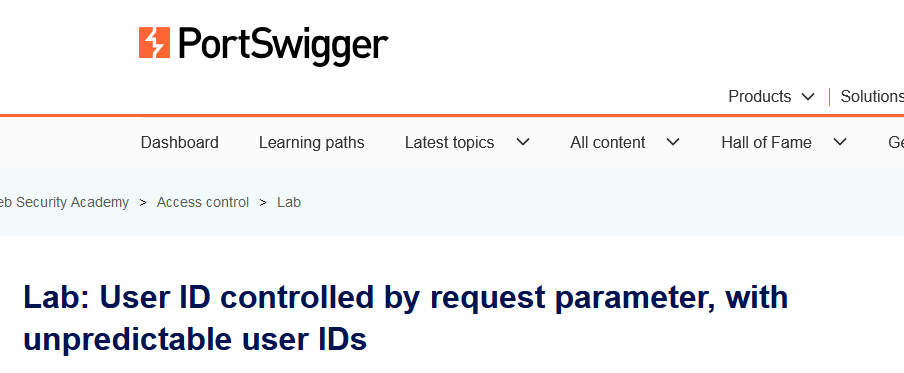
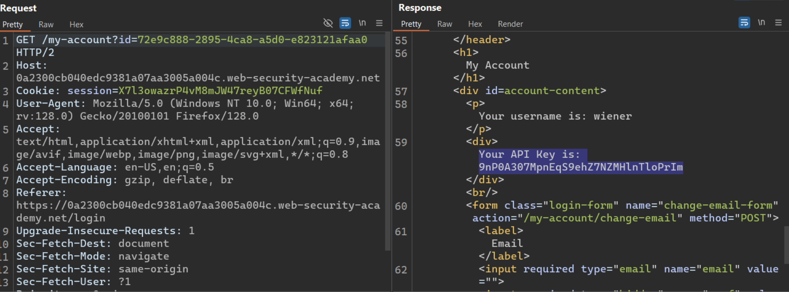
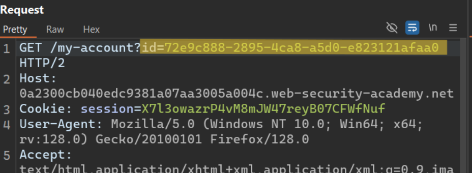
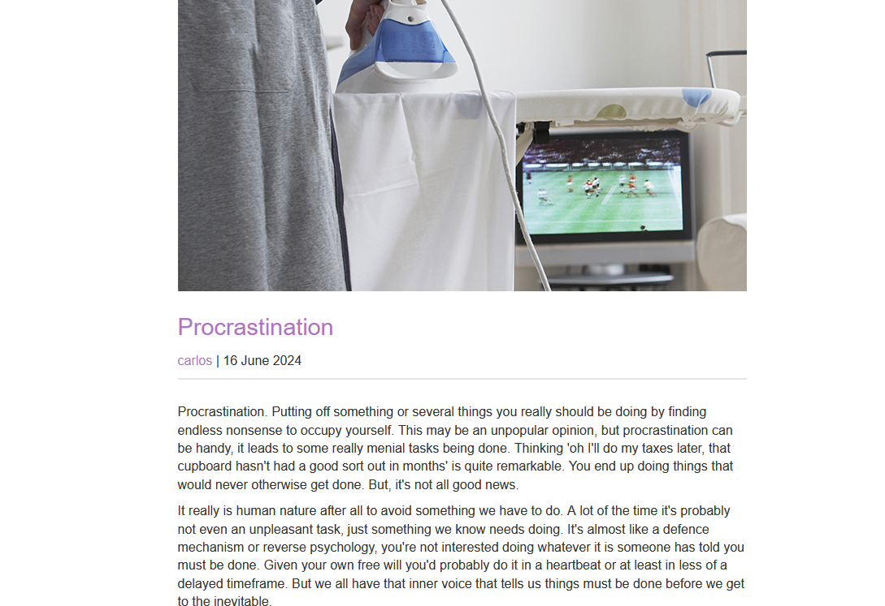
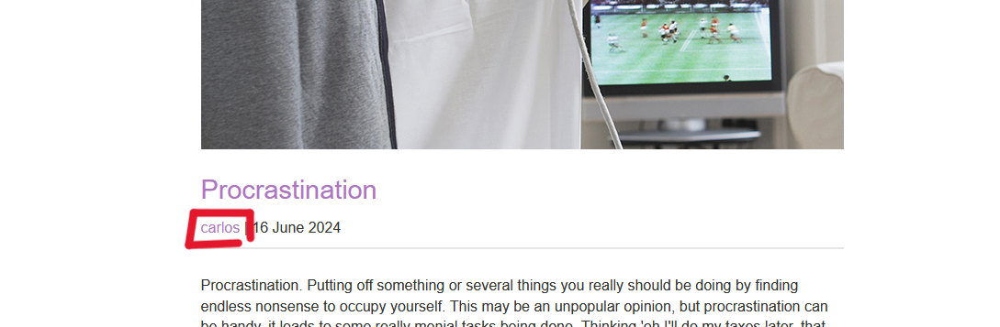
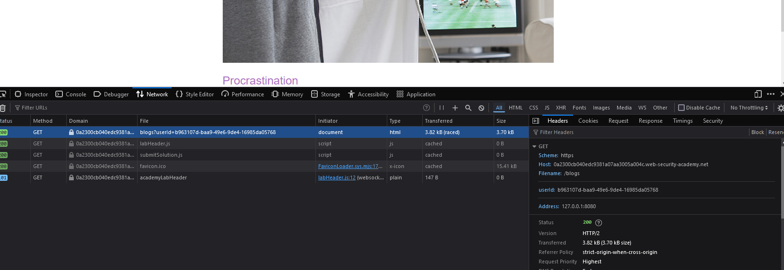
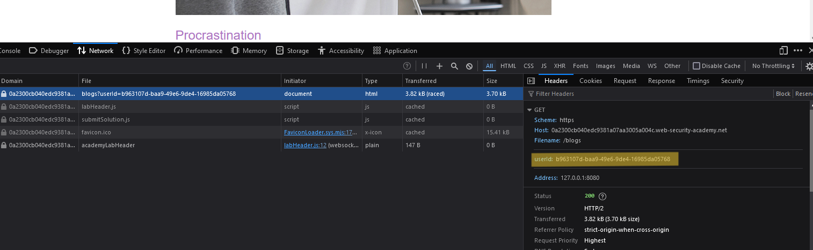
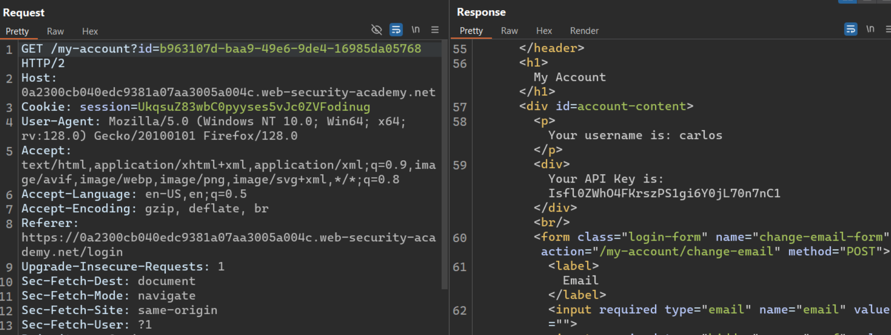
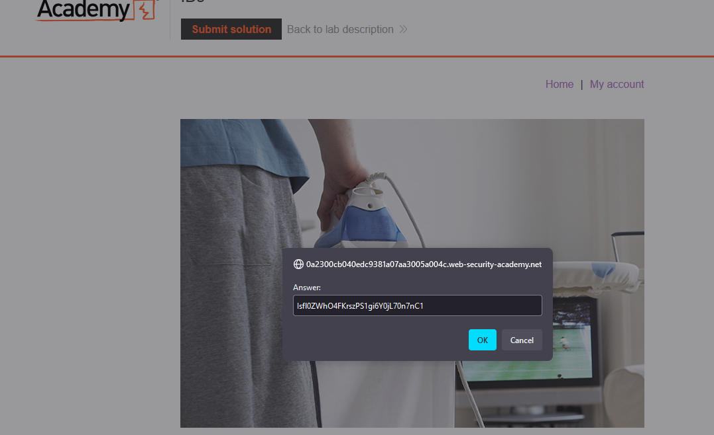

# Writ-up: User ID controlled by request parameter, with unpredictable user IDs

Lab-Link: **[User ID controlled by request parameter, with unpredictable user IDs](https://portswigger.net/web-security/access-control/lab-user-id-controlled-by-request-parameter-with-unpredictable-user-ids)**

Difficulty: APPRENTICE

This write-up for the lab *Unprotected admin functionality* is part of my walkthrough series for [PortSwigger's Web Security Academy](https://portswigger.net/web-security).

## Summary

An __Access Control vulnerability__ in the __request parameter__ makes it easy to access other users' accounts.

## Description

 This lab has a horizontal privilege escalation vulnerability on the user account page, but identifies users with __[GUIDs](https://www.techtarget.com/searchwindowsserver/definition/GUID-global-unique-identifier)__.

To solve the lab, find the __[GUID](https://www.techtarget.com/searchwindowsserver/definition/GUID-global-unique-identifier)__ for `carlos`, then submit his __[API](https://www.ibm.com/topics/api)__ key as the solution.

You can log in to your own account using the following credentials: `wiener:peter` 

## Impact

By testing the site, the hacker can modify the request he sends in order to access other users' accounts.

## what I do

1. From the description of the lab, I inferred that I need to get a user account named `Carlos` to access his [API](https://www.ibm.com/topics/api).

2. I started doing a quick testing for the site and reading the source code quickly to get any information on it or to knowing whether there are important files or not.

3. I found a **login page** that I tried to do a quick test on.

4. Using [Burp Suite](https://portswigger.net/burp/communitydownload) I intercepted the `request` to see the `response`.

5. I concluded that this is `wiener`'s __[GUID](https://www.techtarget.com/searchwindowsserver/definition/GUID-global-unique-identifier)__.

6. Here began the journey to find `carlos`'s __[GUID](https://www.techtarget.com/searchwindowsserver/definition/GUID-global-unique-identifier)__ so that we can obtain his [API](https://www.ibm.com/topics/api).

7. During a quick site testing, I found that users can add posts and comments. Therefore, I started searching for any comments or posts related to `carlos` to find any information leading me to his __[GUID](https://www.techtarget.com/searchwindowsserver/definition/GUID-global-unique-identifier)__.

8. On this page, you can take action by clicking on the name `carlos`.

9. I clicked on the name `carlos` and used the [developer tools](https://developer.chrome.com/docs/devtools/network) to see the requests that were sent to obtain any information.

10. I found in the request headers that there is a `usrid` parameter containing the __[GUID](https://www.techtarget.com/searchwindowsserver/definition/GUID-global-unique-identifier)__ specific to `carlos`.

11. So I returned to the request for `wiener` and replaced `wiener`'s __[GUID](https://www.techtarget.com/searchwindowsserver/definition/GUID-global-unique-identifier)__ with `carlos`'s __[GUID](https://www.techtarget.com/searchwindowsserver/definition/GUID-global-unique-identifier)__, then I obtained `carlos`'s [API](https://www.ibm.com/topics/api).

12. I submitted a solution to solve the lab.

## Short steps

1. Find a blog post by `carlos`.

2. Click on `carlos` and observe that the URL contains his user ID. Make a note of this ID.

3. Log in using the supplied credentials and access your account page.

4. Change the "id" parameter to the saved user ID.

5. Retrieve and submit the [API](https://www.ibm.com/topics/api).

__congratulations!__

## References

*OWASP*: https://owasp.org/Top10/A01_2021-Broken_Access_Control/

*PortSwigger reference & labs*: https://portswigger.net/web-security/access-control

*Medium*: https://cyberw1ng.medium.com/understanding-access-control-vulnerability-in-web-app-penetration-testing-2023-1d29eadd86b7

*Youtube*: [Rana Khalil](https://youtu.be/aaIfsH-fP5c?si=OBPkhMBCQyrMm1fp) or [Michael Sommer](https://youtu.be/KMM4VkXVdjw?si=SBxMzkcBETU_hwxi)