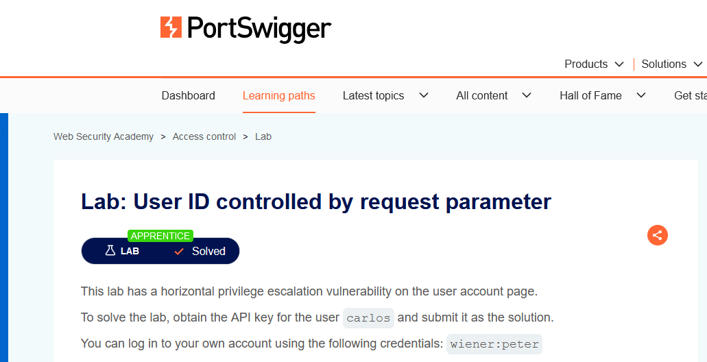
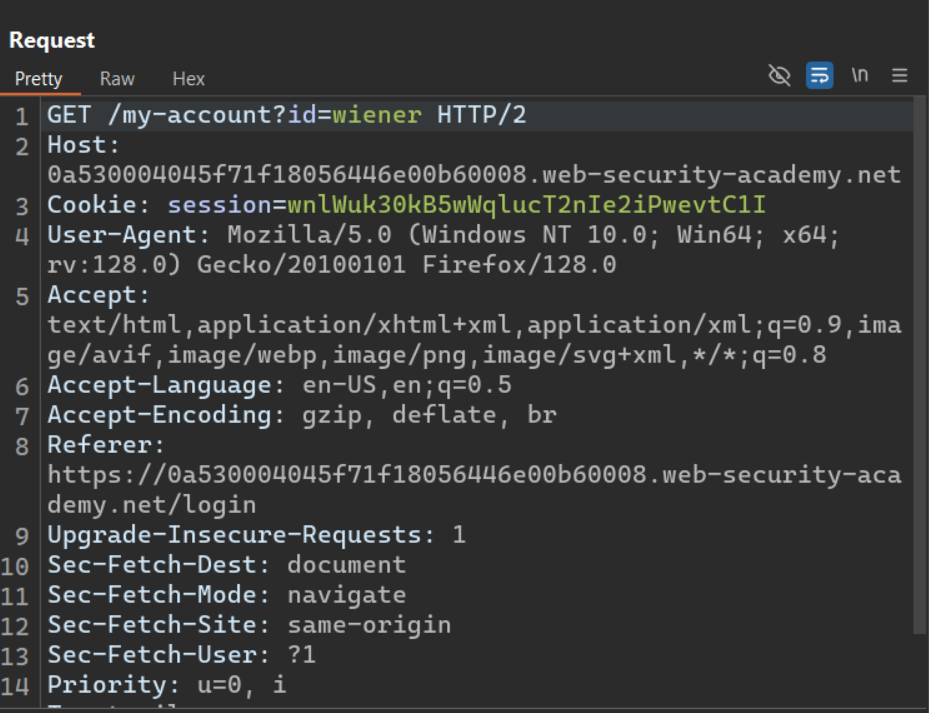
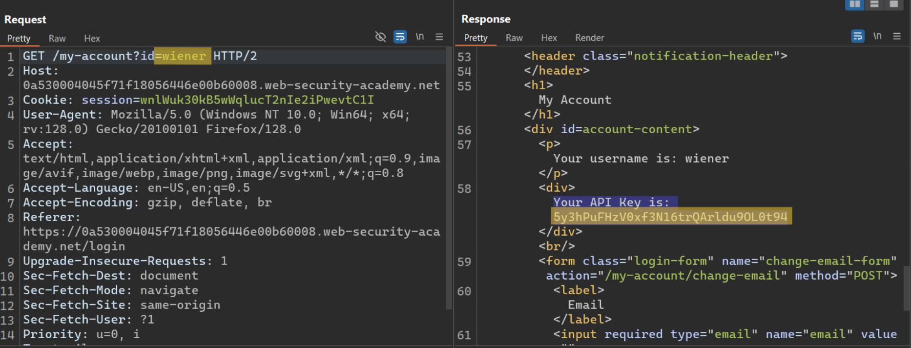
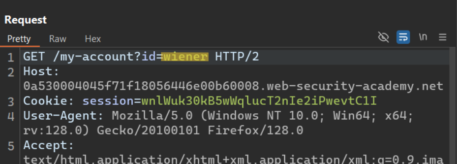
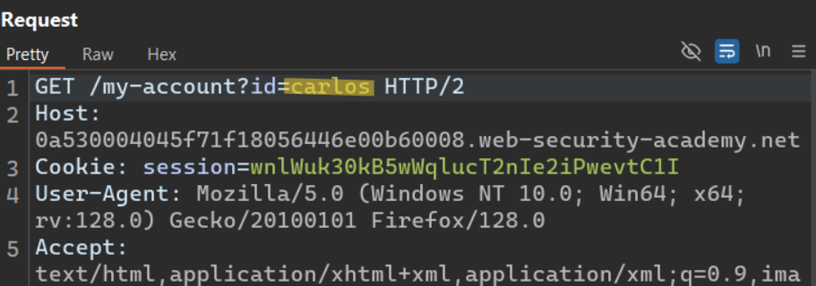
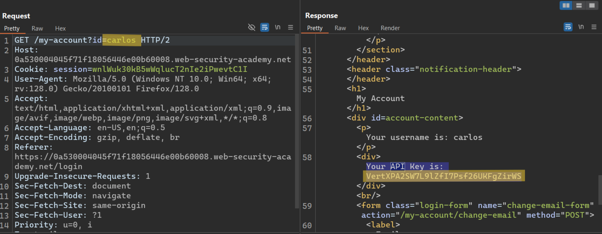
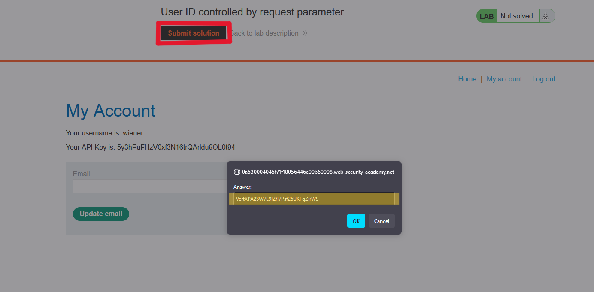

# Writ-up: ID controlled by request parameter

Lab-Link: **[ID controlled by request parameter](https://portswigger.net/web-security/access-control/lab-user-id-controlled-by-request-parameter)**

Difficulty: APPRENTICE

This write-up for the lab *Unprotected admin functionality* is part of my walkthrough series for [PortSwigger's Web Security Academy](https://portswigger.net/web-security).

## Summary

An __Access Control vulnerability__ in the __request parameter__ makes it easy to access other users' accounts.

## Description

This lab has a horizontal privilege escalation vulnerability on the user account page.

To solve the lab, obtain the API for the user `carlos` and submit it as the solution.

You can log in to your own account using the following credentials: `wiener:peter`.

## Impact

By testing the site, the hacker can modify the request he sends in order to access other users' accounts.

## what I do

1. From the description of the lab, I inferred that I need to get a user account named `Carlos` to access his API.

2. I started doing a quick testing for the site and reading the source code quickly to get any information on it or to knowing whether there are important files or not.

3. I found a **login page** that I tried to do a quick test on.

4. Using [Burp Suite](https://portswigger.net/burp/communitydownload) I intercepted the `request` to see the `response`.

5. After sending the request, I found that it returned with the `Wiener` API.

6. The requirement is to obtain the API for `Carlos`, so I modified the **id parameter** and replaced `wiener` with `carlso`.

7. I sent the request and received the API for `carlos`.

8. I submitted a solution to solve the lab.

## Short steps

1. Log in using the supplied credentials and go to your account page.

2. Note that the URL contains your username in the "id" parameter.

3. Send the request to Burp Repeater.

4. Change the "id" parameter to carlos.

5. Retrieve and submit the API key for carlos.

## References

*OWASP*: https://owasp.org/Top10/A01_2021-Broken_Access_Control/

*PortSwigger reference & labs*: https://portswigger.net/web-security/access-control

*Medium*: https://cyberw1ng.medium.com/understanding-access-control-vulnerability-in-web-app-penetration-testing-2023-1d29eadd86b7

*Youtube*: [Rana Khalil](https://youtu.be/-VaKuNDMkR8?si=sb-zB002Uxf-Lm5a) or [Michael Sommer](https://youtu.be/pv5PfMbe_7k?si=bHeut2eA0knz6bXE)