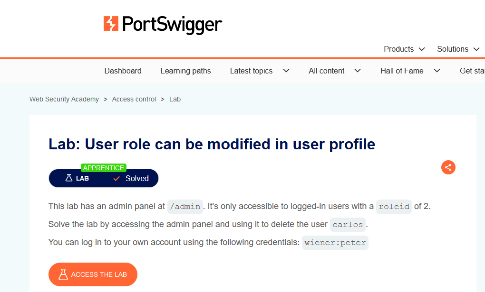
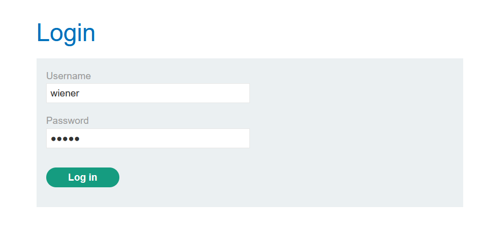
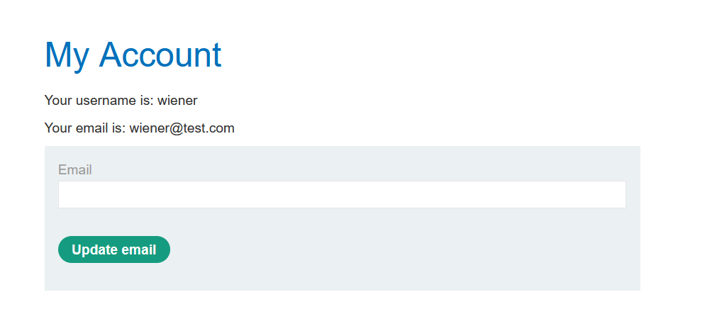
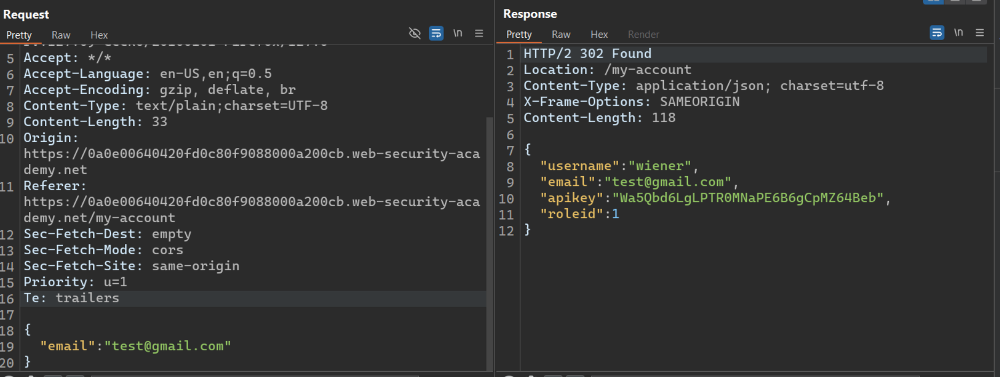
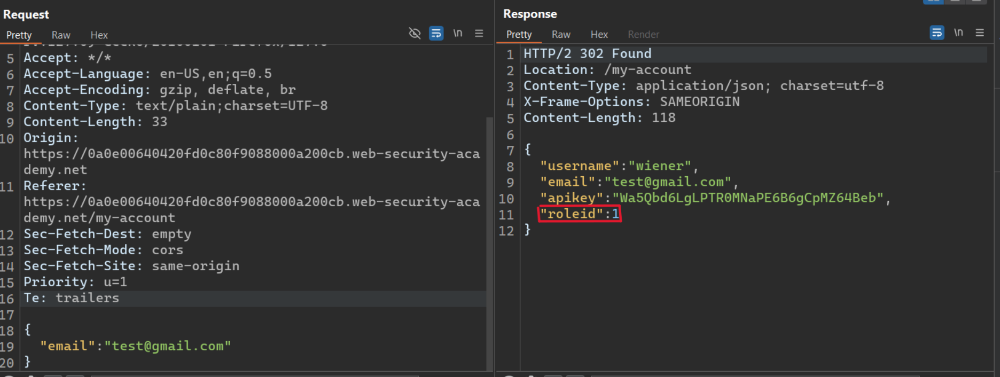
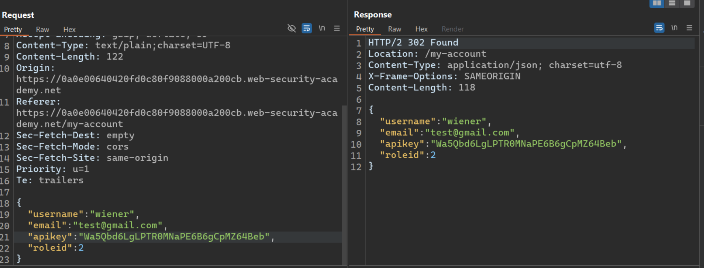
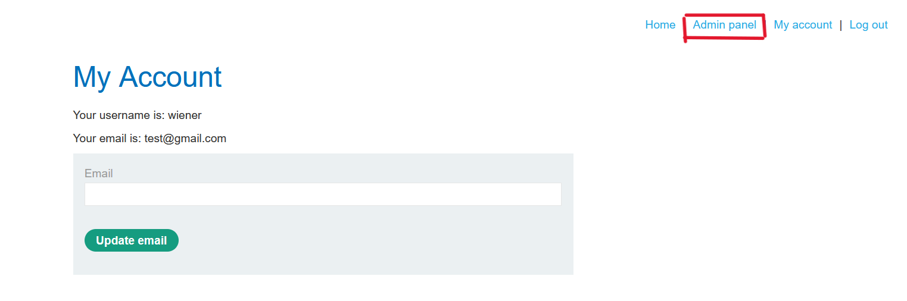
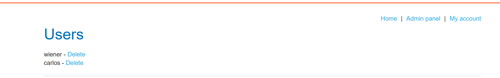

# Writ-up: User role can be modified in user profile

Lab-Link: **[User role can be modified in user profile](https://portswigger.net/web-security/access-control/lab-user-role-can-be-modified-in-user-profile)**

Difficulty: APPRENTICE

This write-up for the lab *Unprotected admin functionality* is part of my walkthrough series for [PortSwigger's Web Security Academy](https://portswigger.net/web-security).

## Summary

An __Access Control vulnerability__ was discovered in the __Admin Panel__ module of the web application, allowing attackers to bypass authentication have admin privileges.

## Description

 This lab has an **admin panel** at `/admin`. It's only accessible to **logged-in** users with a `roleid` of 2.

Solve the lab by accessing the **admin panel** and using it to delete the user `carlos`.

You can **log in** to your own account using the following credentials: `wiener:peter`

## Lab idea

By testing the site, The hacker finds that there is a **function** for changing the email which stores data in the form of a **JSON** file. The hacker then modifies this data to gain **admin privileges**.

## impact

the __Admin Panel__ unprotected, by accessing the **admin panel**, directly the attacker can deleting users accounts from the site.

## what I do

1. I went to the **login page** and logged in using the **username:**`wiener` and **password:**`peter`.

2. After **logging in**, I found that I could change my email address, so I changed my email address in order to intercept the **request** and see the **response**.

3. When I saw the **response**, I found that it was in the form of a **JSON** file, and it contained several data, including a `roleid:1`.

4. I changed the value of `roleid` to 2 and then sent it in the **request**.

5. Immediately, I found that I had obtained **admin privileges** and could access the **admin panel**.

6. I accessed the **admin panel** and deleted `Carlos`.

## Short steps

1. __Log in__ using the supplied credentials and access your account page. 

2. Use the provided feature to update the email address associated with your account.

3. Observe that the __response__ contains your __role ID__.

4. Send the email submission __request__ to [Burp Repeater](https://portswigger.net/burp/documentation/desktop/tools/repeater), add `"roleid":2` into the __JSON__ in the request body, and resend it. 

5. Observe that the response shows your `roleid` has changed to 2.

6. Browse to `/admin` and delete `carlos`.

__congratulations!__

## References

*OWASP*: https://owasp.org/Top10/A01_2021-Broken_Access_Control/

*PortSwigger reference & labs*: https://portswigger.net/web-security/access-control

*Medium*: https://cyberw1ng.medium.com/understanding-access-control-vulnerability-in-web-app-penetration-testing-2023-1d29eadd86b7

*Youtube*: [Rana Khalil](https://youtu.be/jjfe7WRN76o?si=laqgrMnsuIYnkFax) or [Michael Sommer](https://youtu.be/4AXJpx7F9YY?si=zCWxNTHIyXrgzb7S)
