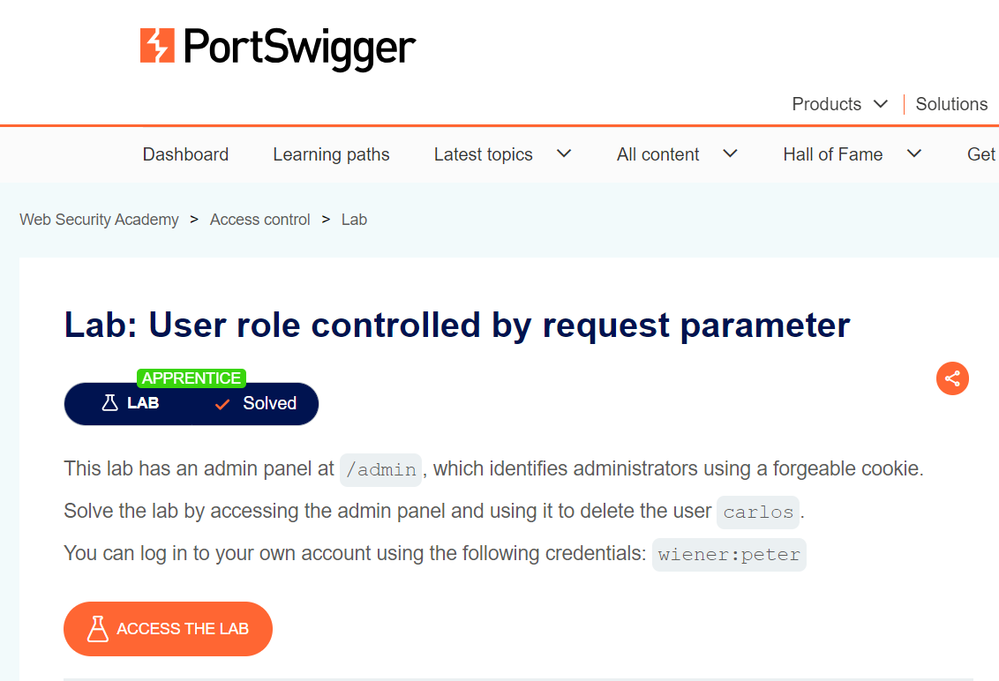
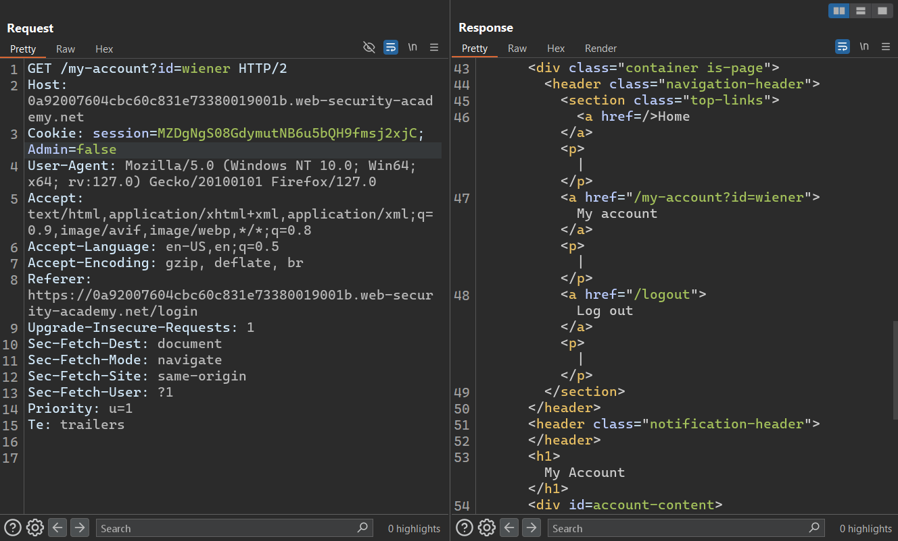
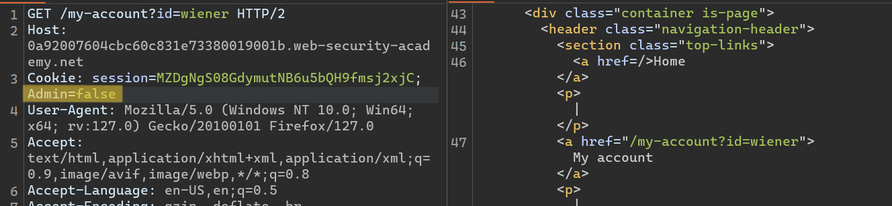
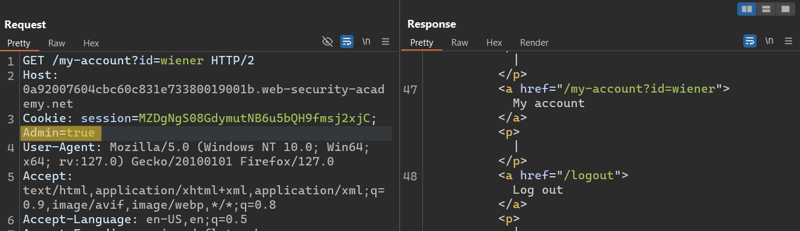
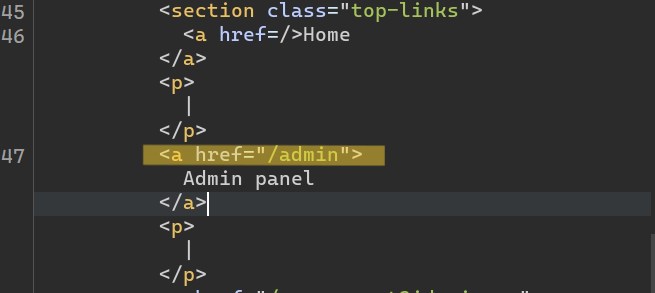
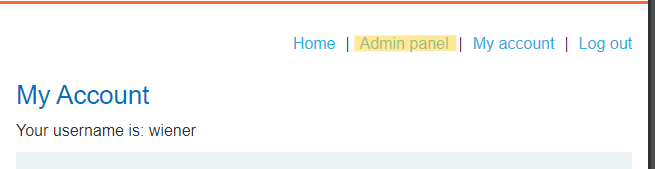
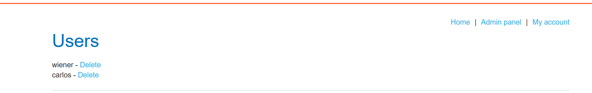
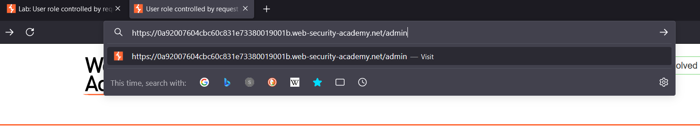
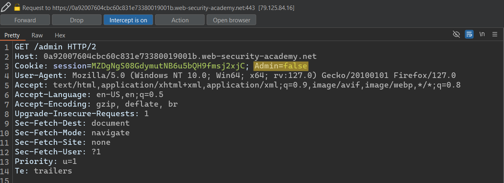
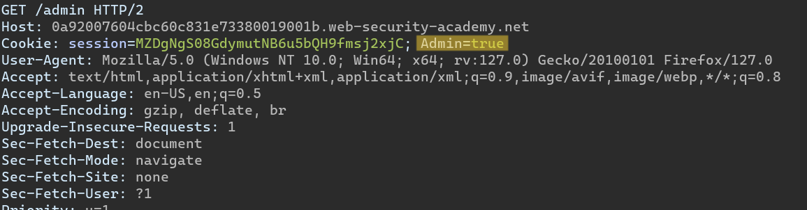

# Writ-up: User role controlled by request parameter

Lab-Link: **[User role controlled by request parameter](https://portswigger.net/web-security/access-control/lab-user-role-controlled-by-request-parameter)**

Difficulty: APPRENTICE

This write-up for the lab *Unprotected admin functionality* is part of my walkthrough series for [PortSwigger's Web Security Academy](https://portswigger.net/web-security).

## Summary

An __Access Control vulnerability__ was discovered in the __Admin Panel__ module of the web application, allowing attackers to bypass authentication have admin privileges.

## Description

This lab has an **admin panel** at `/admin`, which identifies administrators using a forgeable cookie.

Solve the lab by accessing the **admin panel** and using it to delete the user `carlos`.

You can log in to your own account using the following credentials: `wiener:peter`.

## Lab idea

By testing the site, The hacker can obtain **admin privileges** by intercepting the request and modifying it.

# Impact

the __Admin Panel__ unprotected, by accessing the **admin panel**, directly the attacker can deleting users accounts from the site.

## What I do

### The first way

1. From the description of the lab, I concluded that this was an **admin** page, so I had to access it.

2. I found a **login** page that I tried to do a quick test on, I entered the username and password.

3. Using [Burp Suite](https://portswigger.net/burp/communitydownload) I intercepted the **request** to see the **response**.

4. In the **request** I found an `Admin` parameter and its value is `false`, so I replaced it with `true`.

5. Through it, I was able to display the **admin Panel** inside the **HTML** code.

6. Immediately found that I have **admin
privileges** and can delete user accounts.

7. Delete `Carlos` to solve the lab.

---

### Another way

1. From the description there is an **admin** page through the path `/admin`.

2. When I was on the **login** page, I replaced the `/login` with the `/admin` in the **URL**.

3. Using [Burp Suite](https://portswigger.net/burp/communitydownload) I intercepted the __request__ to see the __response__.

4. In the __request__ I found an `Admin` parameter and its value is `false`, so I replaced it with `true`.

5. Immediately found that I have __admin
privileges__ and can delete user accounts.

6. Delete `Carlos` to solve the lab.

## Short steps

1. Browse to `/admin` and observe that you can't access the __admin panel__.

2. Browse to the __login__ page.

3. In [Burp Proxy](https://portswigger.net/burp/documentation/desktop/tools/proxy), turn interception on and enable response interception.

4. Complete and submit the __login__ page, and forward the resulting __request__ in [Burp](https://portswigger.net/burp/communitydownload).

5. Observe that the __response__ sets the cookie `Admin=false`. Change it to `Admin=true`.

6. Load the __admin panel__ and delete `carlos`.

__congratulations!__

## References

*OWASP*: https://owasp.org/Top10/A01_2021-Broken_Access_Control/

*PortSwigger reference & labs*: https://portswigger.net/web-security/access-control

*Medium*: https://cyberw1ng.medium.com/understanding-access-control-vulnerability-in-web-app-penetration-testing-2023-1d29eadd86b7

*Youtube*: [Rana Khalil](https://youtu.be/e_jsPdEeSto?si=MTQDClQjYXiTxhR4)