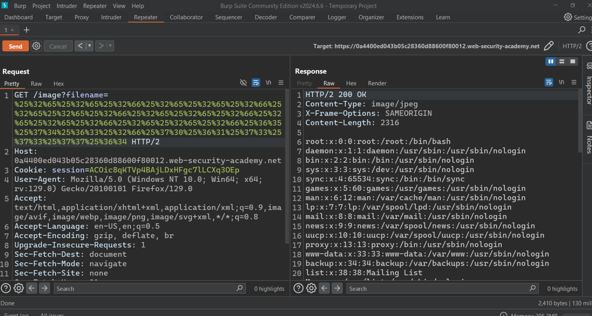

# Writ-up: File path traversal, traversal sequences stripped with superfluous URL-decode

Lab-Link: **[File path traversal, traversal sequences stripped with superfluous URL-decode](https://portswigger.net/web-security/file-path-traversal/lab-superfluous-url-decode)**

This write-up for the lab *File path traversal, traversal sequences stripped with superfluous URL-decode* is part of my walkthrough series for [PortSwigger's Web Security Academy](https://portswigger.net/web-security).

Learning path: Server-side vulnerabilities >> Path traversal

Difficulty: APPRENTICE

## Summary

__Path traversal__ is also known as __directory traversal__. These vulnerabilities enable an attacker to read arbitrary files on the server that is running an application. This might include:

_Application code and data._

_Credentials for back-end systems._

_Sensitive operating system files._

## Description

This lab contains a **[path traversal](https://portswigger.net/web-security/file-path-traversal)** vulnerability in the display of product images.

The application blocks input containing path traversal sequences. It then performs a URL-decode of the input before using it.

To solve the lab, retrieve the contents of the `/etc/passwd` file.

## Impact

an attacker might be able to write to arbitrary files on the server, allowing them to modify application data or behavior, and ultimately take full control of the server.

## what I do

1. From the description of the lab, I realized that I need to access the content of the `passwd` file.

2. I entered the `home` page to take a quick look at its content and found that it only contains images and paragraphs.

3. What caught my attention were the images because they are treated as files, so I took a look at how to retrieve these images on the website.

4. Using [developer tools](https://developer.mozilla.org/en-US/docs/Learn/Common_questions/Tools_and_setup/What_are_browser_developer_tools), I found that images are being called from an image file via a parameter called `filename`.

5. So I thought about modifying the `filename` value and setting `/../../../../../../../../etc/passwd` as the new value to retrieve the `passwd` file.

6. From the description, I realized that the application blocks input containing path traversal sequences. It then performs a URL-decode of the input before using it.

7. The idea here is to encode the path twice because the application only decode the path once. We don't want to write explicit path traversal sequences; instead, they should be encoded.

8. I opened the image link to use with the Burp Suite tool.

9. I went to Decoder Tap to encode the path twice using URL-encode.

10. I took the encoded path and directly placed it as a value inside the filename parameter. I was able to access the contents of the passwd file.

## Short steps

1. Use Burp Suite to intercept and modify a request that fetches a product image.

2. Modify the filename parameter, giving it the value:`..%252f..%252f..%252fetc/passwd`

1. Observe that the response contains the contents of the `/etc/passwd` file.

## References

*OWASP*: https://portswigger.net/web-security/file-path-traversal

*Medium*: https://medium.com/@Steiner254/directory-path-traversal-288a6188076

*Youtube*: [Intigriti](https://youtu.be/nvITajiF3rs) - [z3nsh3ll](https://youtu.be/nclJPOL3PXc) - [Michael Sommer](https://youtu.be/7slk8nYGtY0)