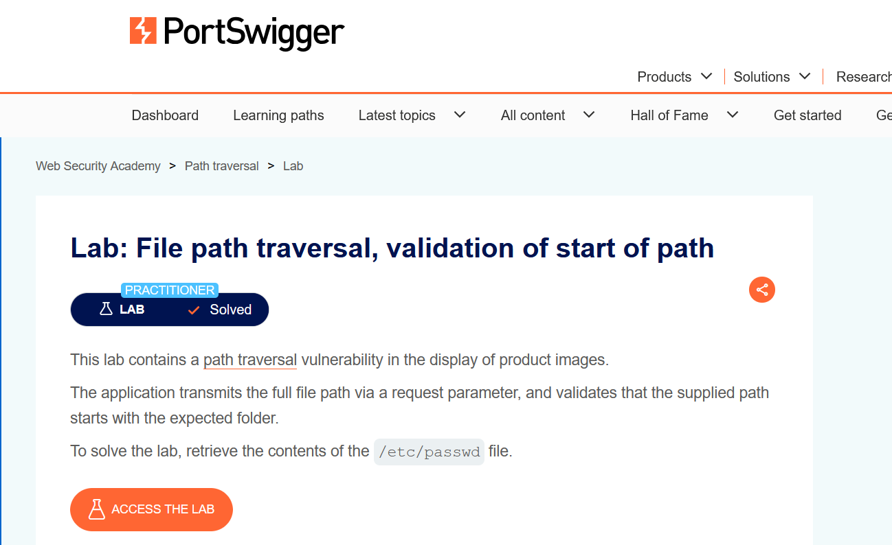
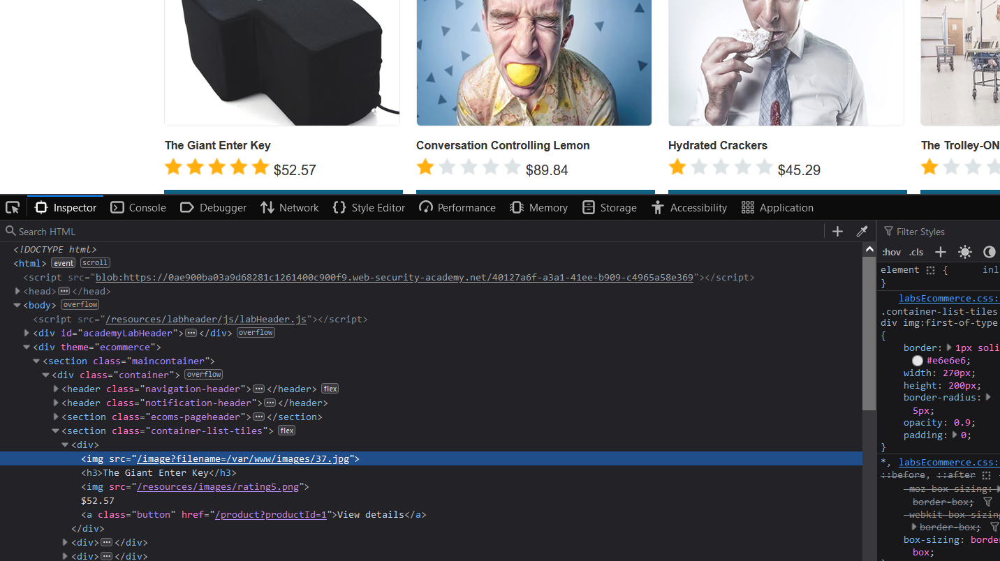
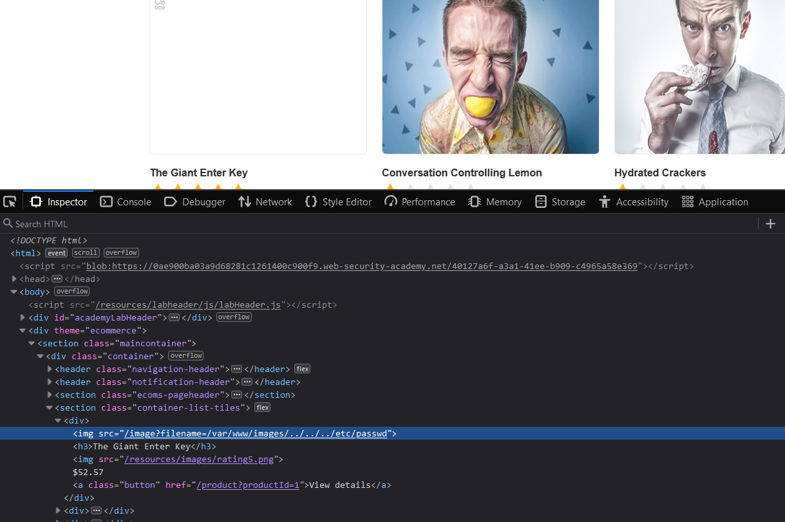
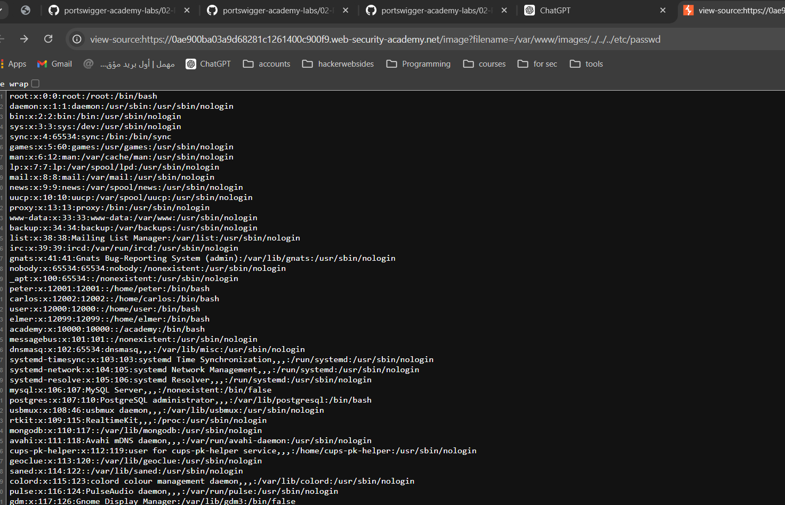
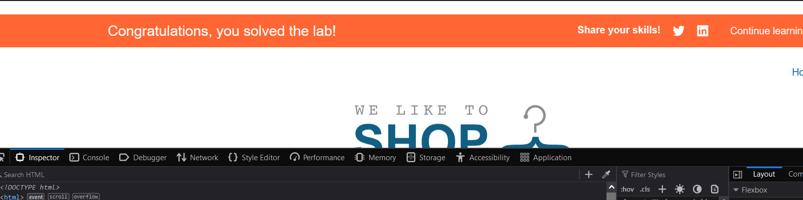

# Writ-up: File path traversal, validation of start of path

Lab-Link: **[File path traversal, validation of start of path](https://portswigger.net/web-security/file-path-traversal/lab-validate-start-of-path)**

This write-up for the lab *File path traversal, validation of start of path* is part of my walkthrough series for [PortSwigger's Web Security Academy](https://portswigger.net/web-security).

Learning path: Server-side vulnerabilities >> Path traversal

Difficulty: APPRENTICE

## Summary

__Path traversal__ is also known as __directory traversal__. These vulnerabilities enable an attacker to read arbitrary files on the server that is running an application. This might include:

_Application code and data._

_Credentials for back-end systems._

_Sensitive operating system files._

## Description

This lab contains a **[path traversal](https://portswigger.net/web-security/file-path-traversal)** vulnerability in the display of product images.

The application transmits the full file path via a request parameter, and validates that the supplied path starts with the expected folder.

To solve the lab, retrieve the contents of the `/etc/passwd` file.

## Impact

an attacker might be able to write to arbitrary files on the server, allowing them to modify application data or behavior, and ultimately take full control of the server.

## what I do

1. From the description of the lab, I realized that I need to access the content of the `passwd` file.

2. I entered the `home` page to take a quick look at its content and found that it only contains images and paragraphs.

3. What caught my attention were the images because they are treated as files, so I took a look at how to retrieve these images on the website.

4. Using [developer tools](https://developer.mozilla.org/en-US/docs/Learn/Common_questions/Tools_and_setup/What_are_browser_developer_tools), I found that images are being called from an image file via a parameter called `filename`.

5. From the description, I understood that I need to access the passwd file from the same directory I am in.

6. That's why I changed the value of the filename parameter to `../../../etc/passwd` to escape from `/var/www/images/` and reach `/etc/passwd`.

7. Indeed, I was able to access the `passwd` file, but the problem is that I couldn't read its content. So, I opened the file using Google Chrome and added `view-source:` before the file link to see the content of the file.

## Short steps

1. Use Burp Suite to intercept and modify a request that fetches a product image.

2. Modify the `filename` parameter, giving it the value:`/var/www/images/../../../etc/passwd`.

3. Observe that the response contains the contents of the `/etc/passwd` file.

## References

*OWASP*: https://portswigger.net/web-security/file-path-traversal

*Medium*: https://medium.com/@Steiner254/directory-path-traversal-288a6188076

*Youtube*: [Intigriti](https://youtu.be/nvITajiF3rs) - [z3nsh3ll](https://youtu.be/lB_GEPEb_iw) - [Michael Sommer](https://youtu.be/9ym9W88oS7w)