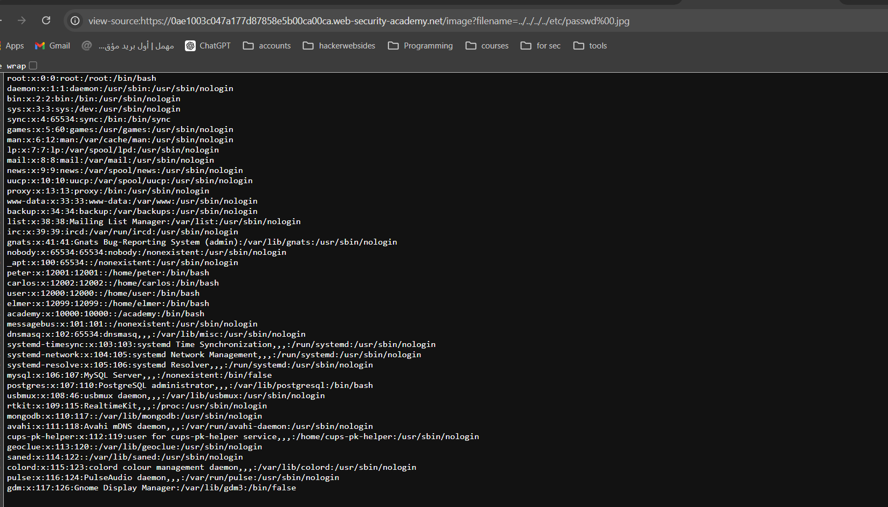

# Writ-up: File path traversal, validation of file extension with null byte bypass

Lab-Link: **[File path traversal, validation of file extension with null byte bypass](https://portswigger.net/web-security/file-path-traversal/lab-validate-file-extension-null-byte-bypass)**

This write-up for the lab *File path traversal, simple case* is part of my walkthrough series for [PortSwigger's Web Security Academy](https://portswigger.net/web-security).

Learning path: Server-side vulnerabilities >> Path traversal

Difficulty: APPRENTICE

## Summary

__Path traversal__ is also known as __directory traversal__. These vulnerabilities enable an attacker to read arbitrary files on the server that is running an application. This might include:

_Application code and data._

_Credentials for back-end systems._

_Sensitive operating system files._

## Description

This lab contains a **[path traversal](https://portswigger.net/web-security/file-path-traversal)** vulnerability in the display of product images.

The application validates that the supplied filename ends with the expected file extension.

To solve the lab, retrieve the contents of the `/etc/passwd` file.

## Impact

an attacker might be able to write to arbitrary files on the server, allowing them to modify application data or behavior, and ultimately take full control of the server.

## what I do

1. From the description of the lab, I realized that I need to access the content of the `passwd` file.

2. I entered the `home` page to take a quick look at its content and found that it only contains images and paragraphs.

3. What caught my attention were the images because they are treated as files, so I took a look at how to retrieve these images on the website.

4. Using [developer tools](https://developer.mozilla.org/en-US/docs/Learn/Common_questions/Tools_and_setup/What_are_browser_developer_tools), I found that images are being called from an image file via a parameter called `filename`.

5. From the description, I realized that the application checks the file extension and verifies whether it matches the expected extension, which is `.jpg`.

6. So I used a null byte [%00](https://en.wikipedia.org/wiki/Null_character) to place it before the extension so that the application checks for the existence of the file, but when processing the file, it will not consider the extension of this file.

7. So I modified the filename parameter to `../../../../etc/passwd%00.jpg`.

8. Indeed, I was able to access the `passwd` file, but the problem is that I couldn't read its content. So, I opened the file using Google Chrome and added `view-source:` before the file link to see the content of the file.

__congratulations!__

## Short steps

1. Use Burp Suite to intercept and modify a request that fetches a product image.

2. Modify the filename parameter, giving it the value:`../../../etc/passwd%00.png`.

3. Observe that the response contains the contents of the `/etc/passwd` file.

## References

*OWASP*: https://portswigger.net/web-security/file-path-traversal

*Medium*: https://medium.com/@Steiner254/directory-path-traversal-288a6188076

*Youtube*: [Intigriti](https://youtu.be/nvITajiF3rs) - [z3nsh3ll](https://youtu.be/HqsmzPMAPc8) - [Michael Sommer](https://youtu.be/vFkrWxsWnoY) - [Maciej Pentester](https://youtu.be/HsWwa5tuo-c)
