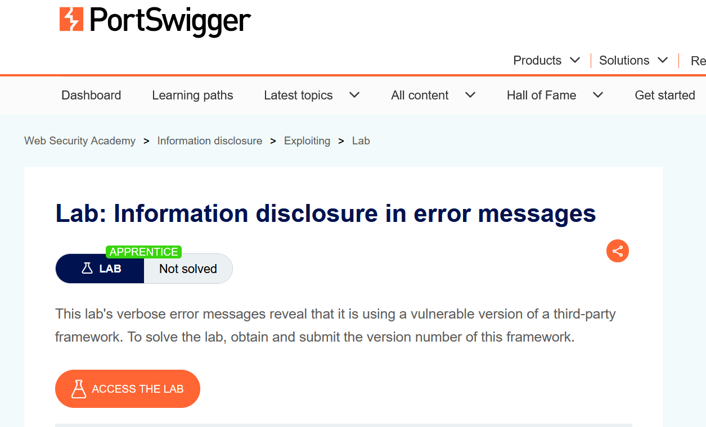
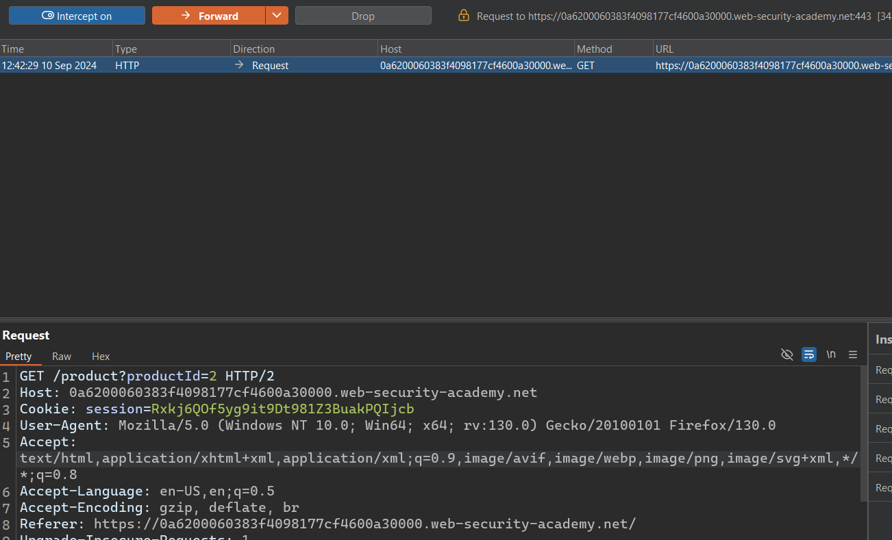
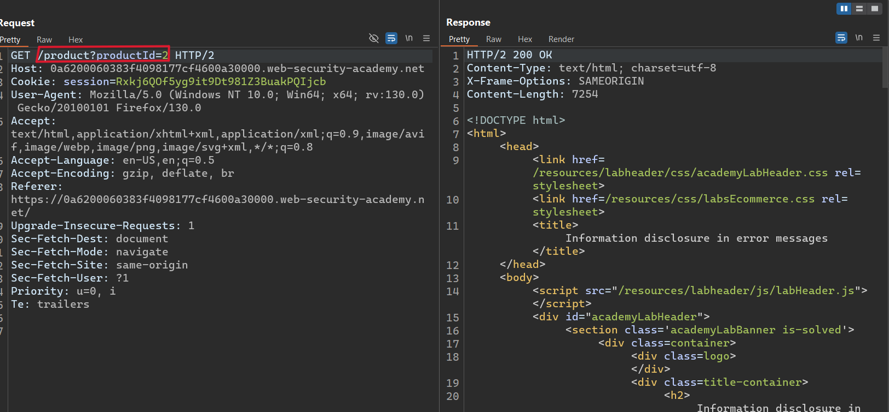
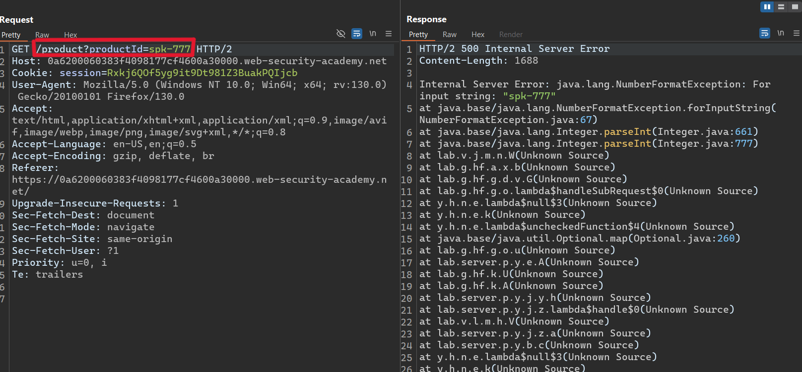
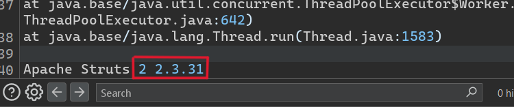

# Writ-up: Information disclosure in error messages

Lab-Link: **[Information disclosure in error messages](https://portswigger.net/web-security/information-disclosure/exploiting/lab-infoleak-in-error-messages)**

This write-up for the lab *File path traversal, traversal sequences stripped with superfluous URL-decode* is part of my walkthrough series for [PortSwigger's Web Security Academy](https://portswigger.net/web-security).

Learning path: Information disclosure > Exploiting

Difficulty: APPRENTICE

## Summary

Information disclosure, also known as information leakage, is when a website unintentionally reveals sensitive information to its users. Depending on the context, websites may leak all kinds of information to a potential attacker, including:

* Data about other users, such as usernames or financial information.

* Sensitive commercial or business data.

* Technical details about the website and its infrastructure.

## Description

This lab's verbose error messages reveal that it is using a vulnerable version of a third-party framework. To solve the lab, obtain and submit the version number of this framework.

## Impact

Information disclosure vulnerabilities can lead to:

1. **Leak of sensitive data**: Exposure of passwords, API keys, or personal information.
2. **Security breaches**: Attackers can exploit leaked details to compromise systems.
3. **Loss of privacy**: Personal user data may be exposed without consent.
4. **Reputation damage**: Businesses lose trust when sensitive information is disclosed.
5. **Regulatory penalties**: Violations of data protection laws, such as GDPR fines.
6. **Increased attack surface**: Disclosed information can help attackers plan targeted attacks.
7. **Financial losses**: Data breaches may lead to compensation claims and recovery costs.

## what I do

1. From the description of the lab, i realized that this lab's verbose error messages reveal that it is using a vulnerable version of a third-party framework.

2. I accessed the home page, found some products with prices, so I opened one of these products and intercepted the request to see what would happen.

3. I sent the request to the [Repeater](https://portswigger.net/burp/documentation/desktop/tools/repeater) tab to modify it and see the response.

1. We see that there is a `productId` parameter that takes numerical values, so i replaced these values with strings to see what would happen.

5. Here we go, that's what i though would happen. indeed, an internal server error occurred and provide me with this info and the version number is on the last line.

6. Go back to the lab, click "Submit solution", and enter **2 2.3.31** to solve the lab.

## Short steps

1. With Burp running, open one of the product pages.

2. In Burp, go to "Proxy" > "HTTP history" and notice that the `GET` request for product pages contains a `productID` parameter. Send the `GET /product?productId=1` request to Burp Repeater. Note that your `productId` might be different depending on which product page you loaded.

3. In Burp Repeater, change the value of the `productId` parameter to a non-integer data type, such as a string. Send the request: `GET /product?productId="example"`.

4. The unexpected data type causes an exception, and a full stack trace is displayed in the response. This reveals that the lab is using **Apache Struts 2 2.3.31**.

5. Go back to the lab, click "Submit solution", and enter **2 2.3.31** to solve the lab.

## References

*PortSwigger*: https://portswigger.net/web-security/information-disclosure

*Medium*: https://medium.com/@ajay.monga73/understanding-information-disclosure-vulnerability-types-causes-and-mitigation-strategies-and-ef3fba195ac1

*Youtube*: [Popo Hack](https://youtu.be/3UkodSolFcI) - [Michael Sommer](https://youtu.be/1vSK3lsrHj0)