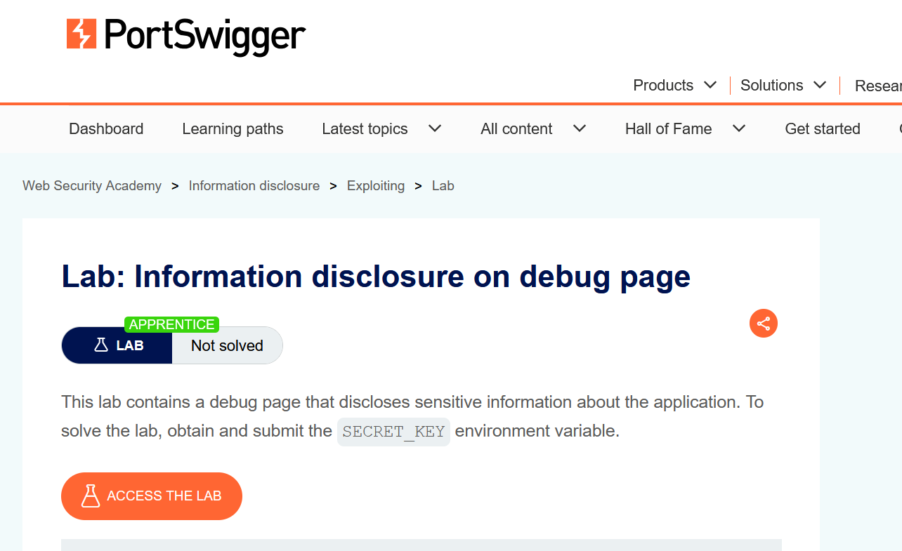
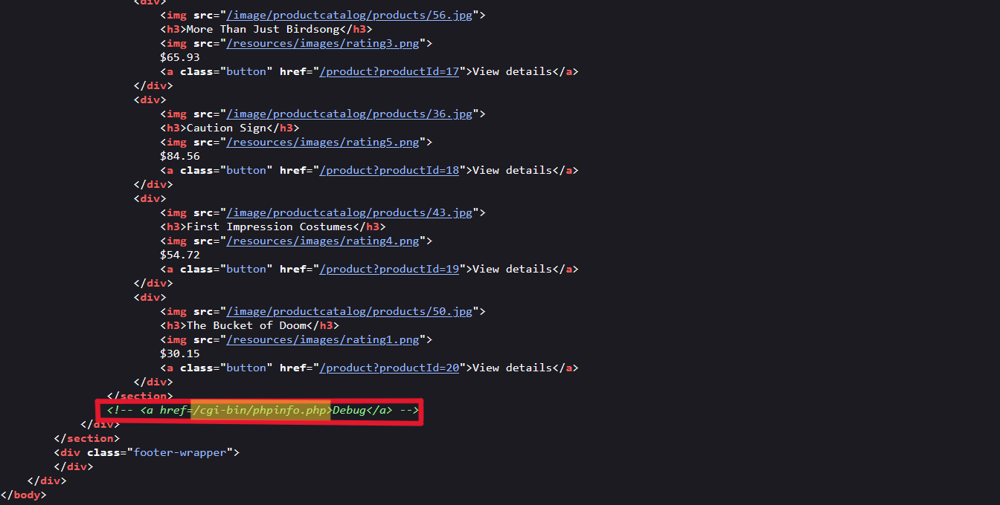
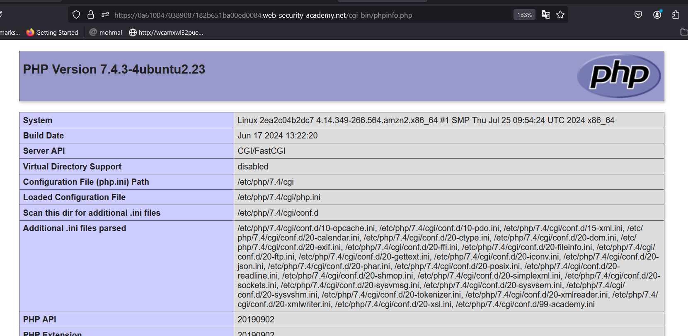
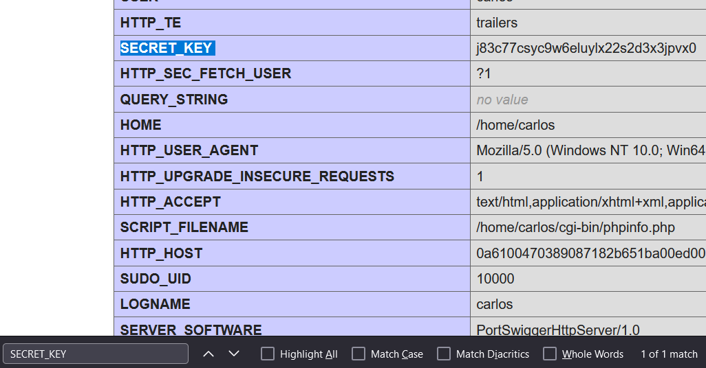

# Writ-up: Information disclosure on debug page

Lab-Link: **[Information disclosure on debug page](https://portswigger.net/web-security/information-disclosure/exploiting/lab-infoleak-on-debug-page)**

This write-up for the lab *File path traversal, traversal sequences stripped with superfluous URL-decode* is part of my walkthrough series for [PortSwigger's Web Security Academy](https://portswigger.net/web-security).

Learning path: Information disclosure > Exploiting

Difficulty: APPRENTICE

## Summary

Information disclosure, also known as information leakage, is when a website unintentionally reveals sensitive information to its users. Depending on the context, websites may leak all kinds of information to a potential attacker, including:

* Data about other users, such as usernames or financial information.

* Sensitive commercial or business data.

* Technical details about the website and its infrastructure.

## Description

This lab contains a debug page that discloses sensitive information about the application. To solve the lab, obtain and submit the `SECRET_KEY` environment variable.

## Impact

Information disclosure vulnerabilities can lead to:

1. **Leak of sensitive data**: Exposure of passwords, API keys, or personal information.
2. **Security breaches**: Attackers can exploit leaked details to compromise systems.
3. **Loss of privacy**: Personal user data may be exposed without consent.
4. **Reputation damage**: Businesses lose trust when sensitive information is disclosed.
5. **Regulatory penalties**: Violations of data protection laws, such as GDPR fines.
6. **Increased attack surface**: Disclosed information can help attackers plan targeted attacks.
7. **Financial losses**: Data breaches may lead to compensation claims and recovery costs.

## what I do

1. From the description of the lab, i realized that this lab contains a debug page that discloses sensitive information about the application.

2. I accessed the home page, found some products with prices.

3. I thought of taking a quick look at the source code of this homepage. While looking, I found a comment referring to a phpinfo page.

4. So i took this path and opened it in the URL. indeed, i accessed phpinfo page that contain info about the application and it's logic, I then started searching for the `secret-key` on this page.

5. Go back to the lab, click "Submit solution", and enter the `SECRET_KEY` to solve the lab.

## Short steps

1. With Burp running, browse to the home page.

2. Go to the "Target" > "Site Map" tab. Right-click on the top-level entry for the lab and select "Engagement tools" > "Find comments". Notice that the home page contains an HTML comment that contains a link called "Debug". This points to `/cgi-bin/phpinfo.php`.

3. In the site map, right-click on the entry for `/cgi-bin/phpinfo.php` and select "Send to Repeater".

4. In Burp Repeater, send the request to retrieve the file. Notice that it reveals various debugging information, including the `SECRET_KEY` environment variable.

5. Go back to the lab, click "Submit solution", and enter the `SECRET_KEY` to solve the lab.

## References

*PortSwigger*: <https://portswigger.net/web-security/information-disclosure>

*Medium*: <https://medium.com/@ajay.monga73/understanding-information-disclosure-vulnerability-types-causes-and-mitigation-strategies-and-ef3fba195ac1>

*Youtube*: [Popo Hack](https://youtu.be/z0NXzONQB0w) - [Michael Sommer](https://youtu.be/ulw2M_4JktU)